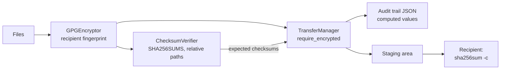

# Secure Genomic Transfer

[](https://github.com/dsugurtuna/secure-genomic-transfer/actions/workflows/ci.yml)

Prepare genomic files to leave your environment: encrypt them with GnuPG, write a `sha256sum`-compatible manifest, stage only encrypted files, and keep an audit trail of what was staged.

> **Portfolio project.** Demonstrates generalised secure transfer workflows. No real data or credentials are included.

**Where this fits:** part of my clinical genomics and biobank data work.
[biobank-data-release-manager](https://github.com/dsugurtuna/biobank-data-release-manager) and
[genomic-cohort-delivery-pipeline](https://github.com/dsugurtuna/genomic-cohort-delivery-pipeline)
produce the files; this repo prepares them for transfer. The principle "read freely, write
carefully" is developed further for AI agents in
[agent-guardrails](https://github.com/dsugurtuna/agent-guardrails).

## The problem

Sending genotype data to a collaborator means encrypting to the right key, proving the files
arrived intact, and being able to show afterwards what was sent. The common failure modes are
quiet: encrypting to an unverified key, a passphrase visible to other users, plaintext copied to
an outgoing folder, or an audit log that records what someone said rather than what happened.

## What this does

- **Encryption** (`GPGEncryptor`): wraps `gpg` for batch encryption and decryption. GnuPG's trust
  model applies by default, so an unvalidated key is refused; `trust_model="always"` is an explicit
  opt-in. Passphrases go on stdin, never in the process list. A dedicated keyring can be used via
  `gnupg_home`.
- **Checksums** (`ChecksumVerifier`): SHA-256 manifests in GNU coreutils format, with paths relative
  to a base directory so the recipient can run `sha256sum -c`. Reads text and binary-mode lines.
- **Staging** (`TransferManager`): streams each file into a staging directory, computes its SHA-256,
  compares it with the expected value, and can refuse anything that does not look like an encrypted
  OpenPGP message.
- **Audit trail**: JSON records of filename, source, size, computed checksum, expected checksum,
  whether the file looks encrypted, status and UTC timestamp.

## Quickstart

Needs GnuPG (`gpg`) on `PATH`.

```bash
git clone https://github.com/dsugurtuna/secure-genomic-transfer.git
cd secure-genomic-transfer
python -m venv .venv && source .venv/bin/activate
pip install -e ".[dev]"
pytest
python examples/demo.py
```

The demo creates a throwaway key for a synthetic recipient in a temporary keyring, encrypts a
made-up VCF, and deletes everything afterwards. Output, checked by `tests/test_demo.py`:

```text
Encrypted: synthetic_cohort.vcf.gpg
Manifest entries: ['synthetic_cohort.vcf.gpg']
Staged synthetic_cohort.vcf.gpg: status=staged, encrypted=True
Refused: synthetic_cohort.vcf does not look like an encrypted OpenPGP message
Recipient check: 1/1 verified
Audit fields: ['checksum', 'encrypted', 'expected_checksum', 'filename', 'size_bytes', 'source', 'status', 'timestamp']
```

In your own code:

```python
from pathlib import Path

from secure_transfer import ChecksumVerifier, GPGEncryptor, TransferManager

enc = GPGEncryptor(recipient="<40-hex-character fingerprint>")
result = enc.encrypt_batch(["outgoing/cohort.vcf.gz"])
print(result.failed_files, result.errors)

verifier = ChecksumVerifier()
manifest = verifier.generate_manifest(result.encrypted_files, base_dir="outgoing")
verifier.write_manifest(manifest, "outgoing/SHA256SUMS")

mgr = TransferManager("staging", require_encrypted=True)
mgr.stage_batch(result.encrypted_files, checksums={f: manifest[Path(f).name] for f in result.encrypted_files})
mgr.export_audit_trail("audit_trail.json")
```

## How it works



## Design decisions

- **Respect GnuPG's trust model by default.** The first version always passed
  `--trust-model always`, which encrypts to whatever key matches the recipient string. Now an
  unvalidated key is refused unless you opt out, having checked the fingerprint out of band.
- **Passphrases on stdin.** Command-line arguments are visible to other users through the process
  list. `--passphrase-fd 0` with loopback pinentry keeps the secret out of it.
- **Record what the code measured, not what the caller claimed.** The audit trail used to store any
  checksum string and "encrypted" flag passed in. Now it stores the computed SHA-256 and a
  detected encryption flag, and flags mismatches with the caller's expectation.
- **Refuse plaintext at the boundary.** Staging is the last point you control. `require_encrypted`
  makes "never stage plaintext" a check rather than a habit.
- **Manifests the recipient can check with standard tools.** Relative paths and the coreutils
  format mean `sha256sum -c SHA256SUMS` works on the other side without this package.
- **Stream, never load whole files.** Genotype files can be many gigabytes.

## Limitations and what this is not

- It does not move data off the machine. Staging is the hand-off to SFTP, a cloud copy tool or a
  managed transfer service, which carry their own controls.
- Key management is out of scope: generating, distributing, verifying and revoking keys happens in
  GnuPG and your organisation's process.
- The encryption check is a header heuristic. It tells plaintext from an OpenPGP message; it does
  not prove the file decrypts or was encrypted to the right key.
- The audit trail is a JSON export. It is not tamper-evident, has no actor identity and lives only
  in memory until exported.
- No signing. Recipients can check integrity against the manifest, but not who produced it,
  unless the manifest is signed separately.

## Roadmap

- Sign `SHA256SUMS` with the sender's key and verify the signature on receipt.
- Hash-chained, append-only audit log with actor identity.
- Optional check that the file decrypts for the intended recipient (`gpg --list-packets`).

## Development

```bash
make dev     # install with dev dependencies
make check   # ruff lint and format check, mypy, pytest
```

The GnuPG integration tests run when `gpg` is installed and are skipped otherwise. See
[docs/WHY.md](docs/WHY.md) for the reasoning behind the design, and
[CONTRIBUTING.md](CONTRIBUTING.md) to contribute.

## Licence

See [LICENSE](LICENSE).

---

Personal project by [Ugur Tuna](https://github.com/dsugurtuna). Not affiliated with or endorsed by any employer.
